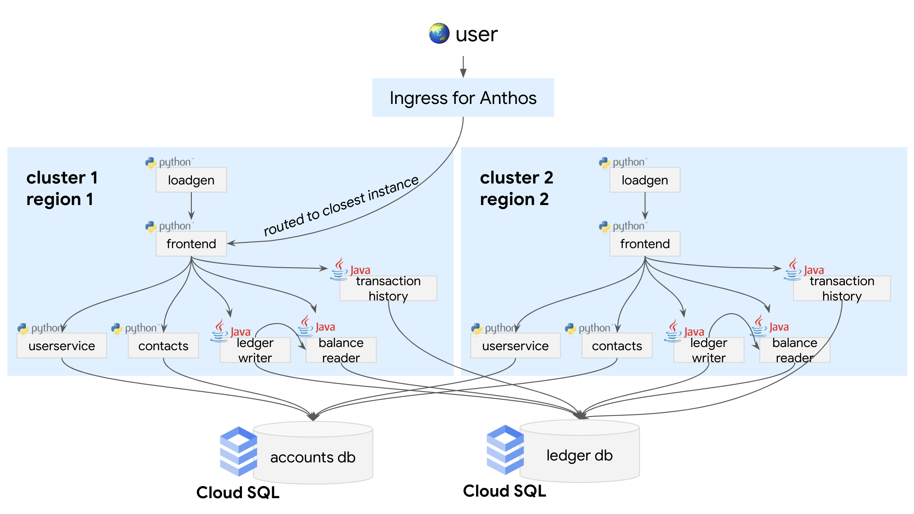

# Multi-region with Cloud SQL 

This doc contains instructions for deploying the Cloud SQL version of Bank of Anthos in a multi-region high availability / global configuration. 

The use case for this setup is to demo running a global, scaled app, where even if one cluster goes down, users will be routed to the next available cluster. These instructions also show how to use [Ingress for Anthos](https://cloud.google.com/kubernetes-engine/docs/how-to/ingress-for-anthos) to route users to the closest GKE cluster, demonstrating a low-latency use case.  



Note that in this setup, there is no service communication between the two clusters/regions. Each cluster has a dedicated frontend and set of backends. Both regions, however, share the same Cloud SQL instance, which houses the two databases (Accounts and Ledger).  

## Prerequisites 

Install the kubectx command line tool  

Anthos license

## Steps 

1. **Create a [Google Cloud project](https://cloud.google.com/resource-manager/docs/creating-managing-projects)** if you don't already have one. 

2. **Set environment variables**, where `DB_REGION` is where the Cloud SQL instance will be deployed

```
export PROJECT_ID="my-project"
export DB_REGION="us-central1"
export CLUSTER_1_NAME="boa-1"
export CLUSTER_1_ZONE="us-central1-b"
export CLUSTER_2_NAME="boa-2"
export CLUSTER_2_ZONE="europe-west3-a"
export NAMESPACE="default"

export PROJECT_ID="megan-fall20"
export DB_REGION="us-central1"
export CLUSTER_1_NAME="boa-multi-1"
export CLUSTER_1_ZONE="us-west1-b"
export CLUSTER_2_NAME="boa-multi-2"
export CLUSTER_2_ZONE="europe-west3-a"
export NAMESPACE="default"
```

3. **Create two GKE clusters, one per region.**

```
gcloud container clusters create boa-1 \
	--project=${PROJECT_ID} --zone=${CLUSTER_1_ZONE} \
	--machine-type=e2-standard-4 --num-nodes=4 \
	--workload-pool="${PROJECT_ID}.svc.id.goog" --enable-ip-alias

gcloud container clusters create boa-2 \
	--project=${PROJECT_ID} --zone=${CLUSTER_2_ZONE} \
	--machine-type=e2-standard-4 --num-nodes=4 \
	--workload-pool="${PROJECT_ID}.svc.id.goog" --enable-ip-alias
```

4. **Configure kubectx for the clusters.**

```
gcloud container clusters get-credentials ${CLUSTER_1_NAME} --zone ${CLUSTER_1_ZONE} --project ${PROJECT_ID}
kubectx cluster1="gke_${PROJECT_ID}_${CLUSTER_1_ZONE}_${CLUSTER_1_NAME}"

gcloud container clusters get-credentials ${CLUSTER_2_NAME} --zone ${CLUSTER_2_ZONE} --project ${PROJECT_ID}
kubectx cluster2="gke_${PROJECT_ID}_${CLUSTER_2_ZONE}_${CLUSTER_2_NAME}"
```

5. **Set up Workload Identity** for both clusters. When the script is run for the second time, you'll see some errors (GCP service account already exists), this is ok. 

```
kubectx cluster1 
./setup_workload_identity.sh

kubectx cluster2
./setup_workload_identity.sh
```

6. **Run the Cloud SQL instance create script** on both clusters. You'll see errors when running on the second cluster, this is ok. 

```
kubectx cluster1 
./create_cloudsql_instance.sh 

kubectx cluster2
./create_cloudsql_instance.sh 
```

7. **Deploy the DB population jobs to one cluster.**  You only need to run these Jobs once. 

```
kubectx cluster1 
kubectl apply  -n ${NAMESPACE} -f ./kubernetes-manifests/config.yaml
kubectl apply -n ${NAMESPACE} -f ./populate-jobs
```

8. Wait a few minutes for the Jobs to complete. The Pods will be marked as  `0/3 - Completed` when they finish successfully. 

```
NAME                         READY   STATUS      RESTARTS   AGE
populate-accounts-db-js8lw   0/3     Completed   0          71s
populate-ledger-db-z9p2g     0/3     Completed   0          70s
```

9. **Deploy Bank of Anthos services to both clusters.** 

```
kubectx cluster1 
kubectl apply  -n ${NAMESPACE} -f ./kubernetes-manifests

kubectx cluster2
kubectl apply  -n ${NAMESPACE} -f ./kubernetes-manifests
```

10. **Run the Ingress for Anthos setup script.** This registers both GKE clusters to Anthos with "memberships," and sets cluster 1 as the "config cluster" to administer the Ingress for Anthos resources. 

```
./register_clusters.sh
```


11. **Create Ingress for Anthos resources for global routing.**  `mcs.yaml` creates a headless Multicluster Kubernetes Service ("MCS"), `frontend-mcs` mapped to the `frontend` Pods.  `mci.yaml` creates a multi cluster Ingress resource, `frontend-global-ingress`, with `frontend-mcs` as the backend. 

```
kubectx cluster1
kubectl apply -n ${NAMESPACE} -f multicluster-ingress/mcs.yaml 
```


12. **Verify that the multicluster ingress resource was created.** Note that this may take several minutes.

```
kubectx cluster1
watch kubectl describe mci zone-ingress -n zoneprinter
```


13. [Optional] Test geo-aware routing. Create a 